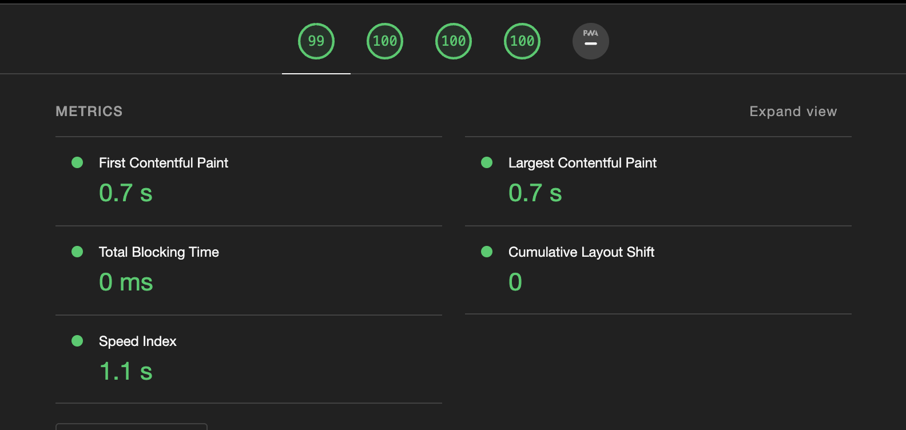
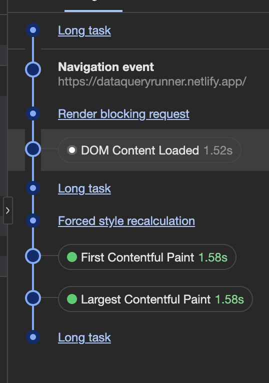

# SQL Query Runner

This project is a sample prototype of a SQL query runner you can view the website in this link https://dataqueryrunner.netlify.app/

# 1. Walkthrough video

You can view the walkthrough of the project in the [video](https://www.loom.com/share/46e442f71c7249ec85a93d594cb72290?sid=b6cdce6a-e5f8-45af-a644-8b578924be13)

https://www.loom.com/share/46e442f71c7249ec85a93d594cb72290?sid=b6cdce6a-e5f8-45af-a644-8b578924be13

# 2. Tech stack of the project

-   React - Popular framework with a great community support it also offers great flexibility and variety of open source components to choose from.

-   Typescript - Typing solves major uncaught issues in the compilation stage itself so choose typescript (Might be an issue if you are majorly dealing with dynamic data set )

-   antd - Considering the time limit of the challenge building all the components from scratch is not feasible so opted for one of the popular React UI library.

-   tailwindCSS - Same consideration for time limit I opted for tailwind for the configurations and ease of use

-   Recharts - While dealing with multitude of data it make sense to view the data in the form of charts to draw insights into it.

# 3. Page loading time

-   Page speed as per light house metrics
    

-   Page loading time with no throttling via performance insights(experimental)
    

# 4. optimizations

-   Lazy loaded the tables and graphs cutting about 170kb worth of javascript on initial page load.

-   Implemented Virtual table to show large size of data in the table without breaking the browser.

-   Added Meta descriptions for better SEO reach.

-   Modified Colors, Added alt attributes and aria label to support better accessibility.

# 5. Features Which can be added in the future

-   Data Validation ( the provided in the sample itself contains empty rows and mismatch data we can use a dedicated webworker to process the entire data without affecting the main thread).

-   Comparative analysis - Compare two or three columns to view the insight between them

-   Import Graphs as pdf
